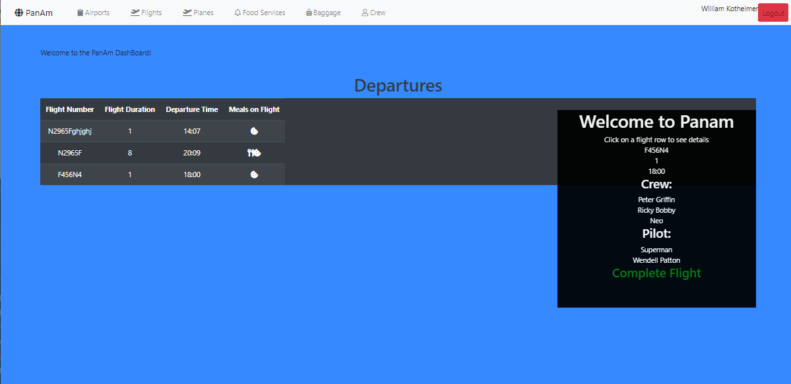
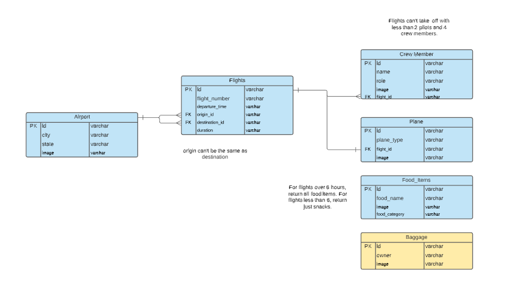
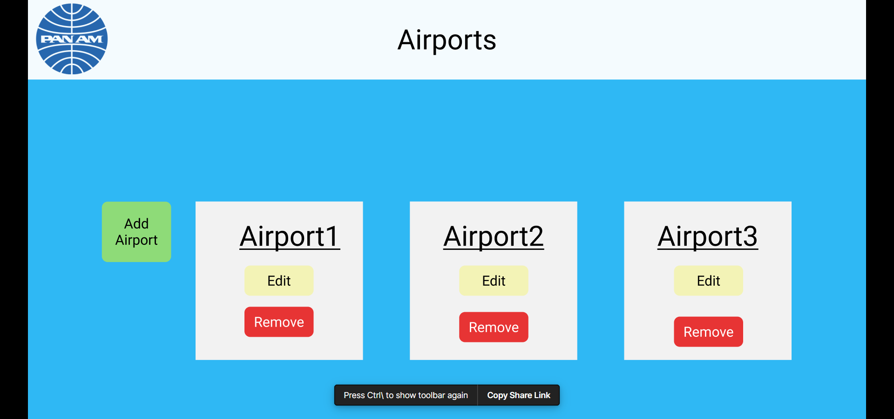

# pan-am-airlines-dashboard

# DEPLOYED
This project was deployed via Firebase
https://fir-pan-am.web.app/

# DESCRIPTION
 This project is called nutshell. We were tasked with finishing a half finished project on top of new requirments. The project was about making CRUD for a PanAm app. The new requirements were to be able to book flights with crew, meals (flights under 6hrs = snack, over 6hrs = snack, meal), destination, and your choice of plane. 

# MOTIVATION/CONTEXT
This project was completed as part of our portfolio at Nashville Software School. It was a collaborative effort that showcases our newly-acquired skills in using Firebase, Postman, and API's as well as relational databases. 

# TECHNOLOGY/TOOLS EMPLOYED
  - VS CODE
  - Javascript
  - HTML5
  - SASS/CSS
  - BOOTSTRAP
  - FIREBASE
  - POSTMAN
  - AXIOS
  - GITHUB
  - JQuery
  - Git

# CONTRIBUTORS
 - Chris Calhoun
 - Jordan Smith
 - Wendell Patton
 - Will Kotheimer

# ERD

# WIREFRAME

[Check out the rest here](https://www.figma.com/file/9y9GwujaCg3Rzr5w2QCHra/PanAm?node-id=0%3A1)

